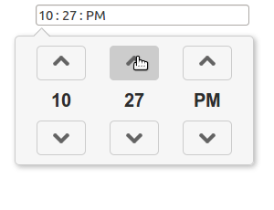
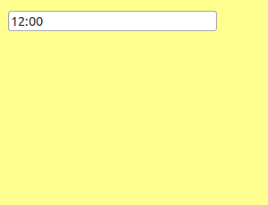

traditional time picker

NEW js-clock time picker

Time picker
===========

I have been annoyed by choosing a time on web pages.
I usually find select boxes or something like
http://www.mytechtip.com/2014/03/angularjs-timepiker-popup-ui-bootstrap.html or http://jquery-plugins.net/tag/timepicker
These time pickers make me clicking three dozen times with my mouse to select a time on a web page.
With the keyboard I usually need only 4 keystrokes which is much faster than these time pickers.
But I do not like to switch from my mouse to the keyboard and back again.

That's why I tried to create an easy-to-use input element for time.
You can select the time by dragging the clock hand around with your mouse.

You can get an impression of my intention on http://htmlpreview.github.io/?https://github.com/joerg-pfruender/js-clock/blob/master/src/test/timepickertestharness.html (preview does not work in Internet Explorer)

Usage:
------
* Please look at the timepickertestharness for example usages.
* It currently works with a 24 hour string representation.
* I tried to make it independent from any javascript library, so that it can be used on any website.
* Please adapt it for your own needs and give me feedback.

Next TODOs:
-----------

* update pixel position calculation for time on zoom
* make it work with other html input types: date-time, local-date-time, untyped

What won't be done
------------------

There won't be support for setting the time more accurate than quarter hours, since this is usually no scenario in day to day use.

Only public transportation needs more accuracy than quarter hours.